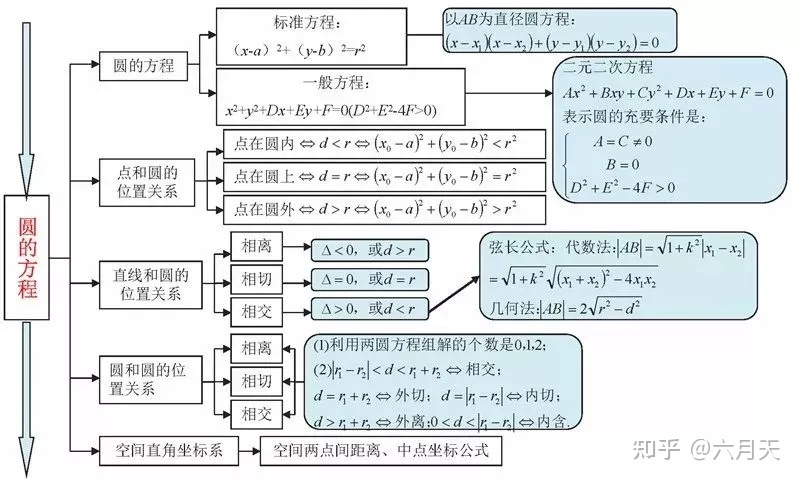

# 高考数学知识点思维导图

##### 集合

##### 不等式

##### 函数

##### 三角函数

##### 解三角形

##### 数列

##### 空间向量与立体几何

##### 直线方程

##### 圆的方程

##### 10

##### 圆锥曲线

##### 12

##### 13

##### 14

##### 复数

##### 简单几何体

##### 17

##### 二项式定理

##### 概率与统计

##### 算法
