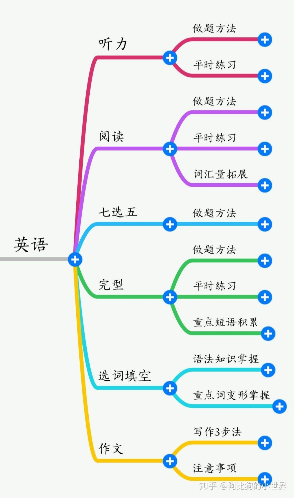

# 英语是最好提分的一科，没有之一
content word & function word

身边有很多很多这样的例子，在高一高二英语没有跟上的同学，在高三用对了方法，使对了巧劲，学会了刷题和总结，最后提分都至少 30+，他们的英语科目也从原来的拖后腿科目到高考的锦上添花。

想要学好英语，光靠看语法书、背单词和刷高考真题是不够的，还需要积累、练习与反思，或者说建立起自己的学习系统。

我的这套方法建立在把一张试卷分析透彻的基础上，今天就带着大家一起把一张高考试卷的题型吃透，探索自己能努力的方向和总结独到的学习和做题方法～

---

### 词汇篇
高考你能把初中英语书词汇表中的词汇、高中英语书词汇表中的词汇都熟练掌握，绝对是足够了。
### 语法篇
不看语法书，看高考教辅书。《无敌英语语法》
### 听力篇
高考阅读出题，都是以考纲为导向的，跳不出来。但听力是一个例外
1. 单词表
通过大声读单词来记单词、熟悉单词。
2. 听录音
不需要一字不拉，听大概意思就行
3. 答题技巧
高考听力相当一部分是技巧大战，从放音前的浏览、预测，再到放音中的猜测、预判等等。跟随老师的总结。

### 阅读篇
先读文章再做题，这样的好处主要是速度快、效率高、阅读体验好。抱着欣赏、应用英语的态度，不要是应试心态。
阅读题分两类：细节题和理解题
1. 细节题：细节题的做题方法主要就是“回看法”，即把题干带入原文相应位置、相应段落，寻找文中出现的题肢，找出出处。这个方法非常简单、自然，不再赘述。
2. 理解题：往往以“以下哪个是本文的标题”、“本文主要讲了什么”、“作者的态度是什么”。
做题绝招，一共只有四个关键词：全面、中立、首尾、频率。

### 完形填空
高考丢分重灾区。
“错题本”小本子。 300个完形填空高频词。

### 作文
高分：连贯、自然的表达。尽量用暗展（单词的不同形式），少用明展（连接词）。

