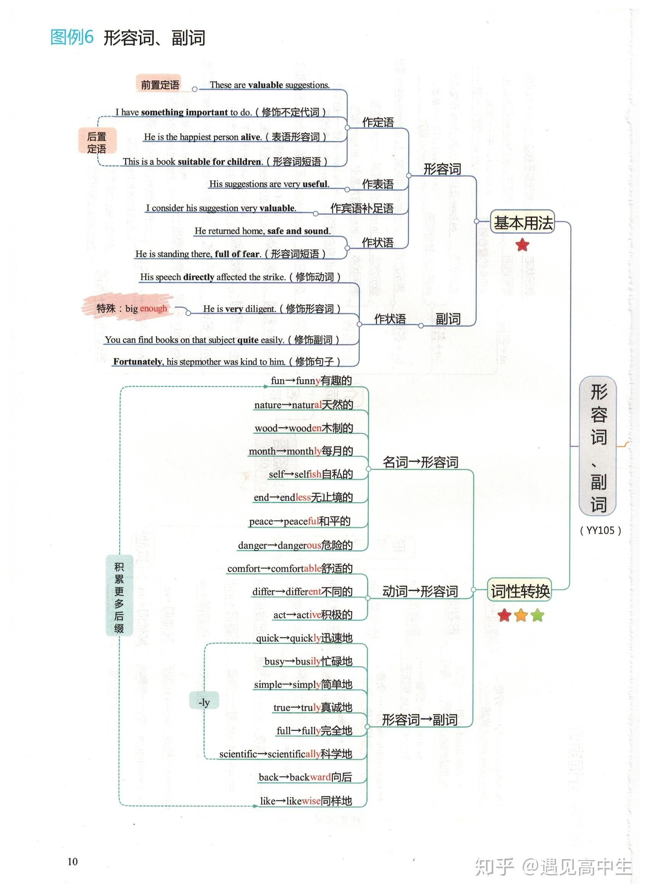

# 高考英语知识点思维导图

##### 词法

##### 语法知识结构总图

##### 名词

##### 

##### 代词

##### 

##### 介词

##### 介词短语

##### 形容词、副词

##### 比较等级

##### 冠词

##### 动词

##### 动词短语

##### 情态动词

##### 

##### 非谓语动词

##### 动词不定式

##### 动词的时态

##### 

##### 被动语态

##### 句子的种类

##### 主谓一致

##### 

##### 名词性从句

##### 宾语从句、主语从句

##### 定语从句

##### 

##### 状语从句

##### 

##### 特殊句式

