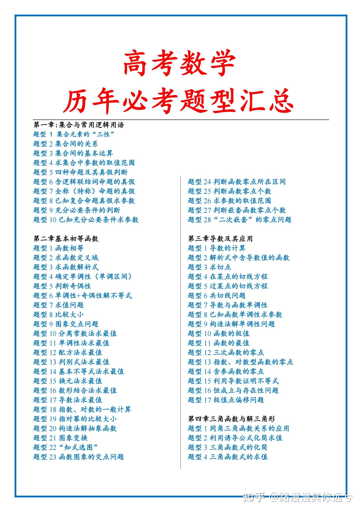
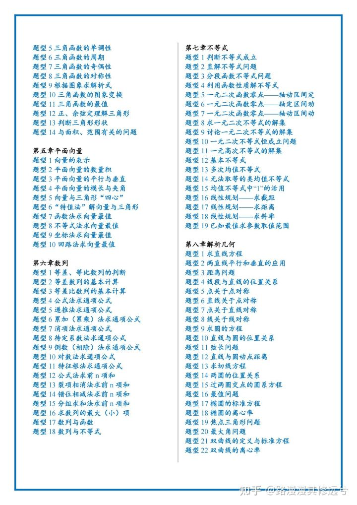
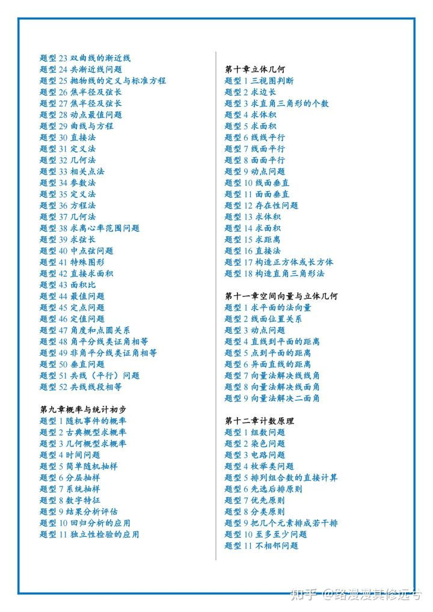
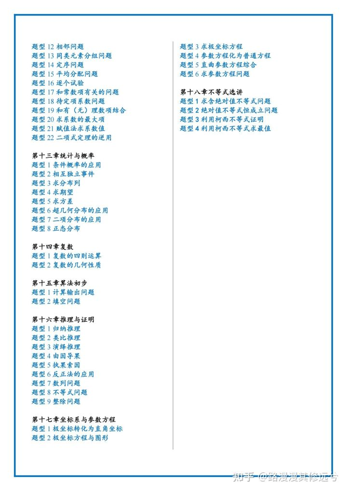

# 必考题型清单

考纲：高考一直围绕着“8020法则”出题，即高考试题中80%是基础知识，20%是稍难的综合题。

以数学为例高考数学中，选择题前8道，填空题前3道，解答题前3道，是最基础的题型，你只需要学好集合、三角函数、向量、数列等这些基础知识，就能达到90分以上。

在这些知识基础上，再补充圆锥曲线、几何、概率统计三大模块，就相当于搞定了80%的题型，分数能达到120分以上。

最后在条件允许的情况下，适当练习导数、圆锥曲线不定点等难点，才有希望冲刺140 以上。

总之，在8020法则的基础上，循序渐进，数学才能稳步提升。数学，三年一个3002个知识点，但核心考点只有259个就120类443道必考、常考题型，只要把这些题学会，高考数学130+应该没问题

